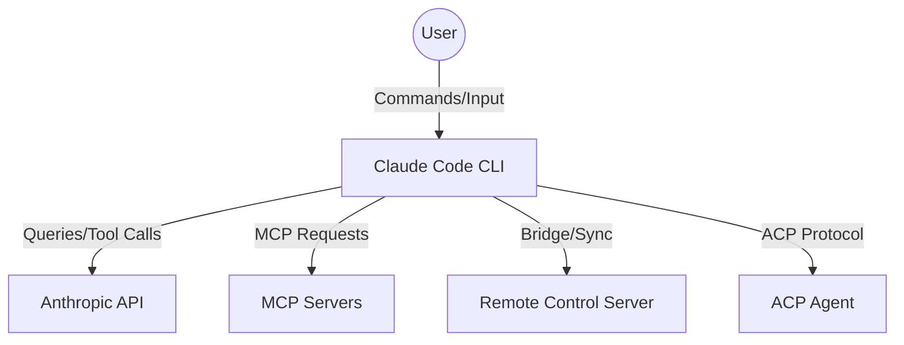
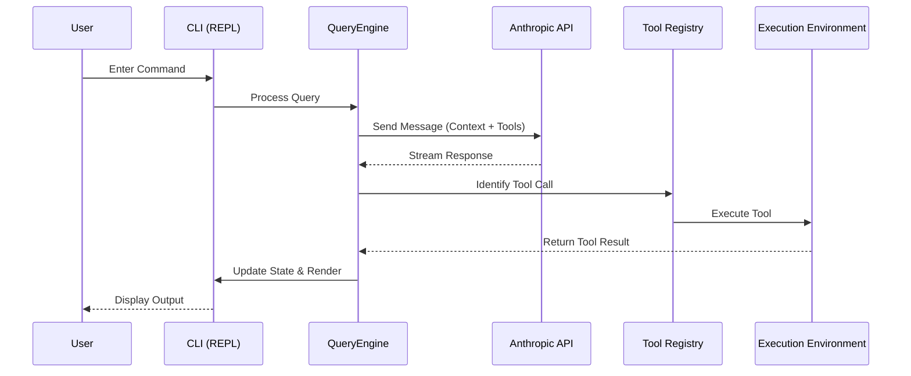

# Project Codemap: Claude Code (Decompiled/Reverse-Engineered)

This is a reverse-engineered version of Anthropic's official Claude Code CLI tool, implemented in TypeScript and running on the Bun runtime. It is designed to restore core functionality while maintaining a lean footprint.

## 🏗 System Architecture Overview

The system follows a layered architecture to decouple the user interface, the core orchestration logic, and the external service integrations.

### Layered Architecture
1.  **Presentation Layer (UI)**: Built with **Ink** and **React**. Handles terminal rendering, user input, and real-time state updates.
2.  **Orchestration Layer**: The "brain" of the application. Manages the conversation state, context windows, and the turn-based loop between the user and the LLM.
3.  **Service Layer**: Abstracted clients for various APIs (Anthropic, OpenAI, Gemini, Grok), the ACP protocol, and the Remote Control Bridge.
4.  **Tool Layer**: A modular registry of capabilities (File I/O, Shell, Web, MCP, etc.) that the LLM can invoke.
5.  **Infrastructure Layer**: The **Bun** runtime, file system, and network stack.

---

## 👥 Actor Diagram

The following diagram illustrates the actors involved in the system and their primary interactions.

---

## 🔄 Core Interaction Flow (Query Loop)

When a user submits a command, the system follows this sequence:

---

## 📂 Module & Package Breakdown

### 1. Entry & Bootstrap
- **`src/entrypoints/cli.tsx`**: The main entry point. Handles high-priority paths (version, system prompt) and branches into specialized modes (Computer Use, Remote Control, Daemon).
- **`src/main.tsx`**: The core CLI definition using Commander.js. Registers all major subcommands and manages the main action handler.
- **`src/entrypoints/init.ts`**: Handles one-time initialization (telemetry, configuration, and trust dialogs).

### 2. Core Execution Loop
- **`src/query.ts`**: The primary API query function. Manages the message exchange with the Claude API, handles streaming responses, and processes tool calls.
- **`src/QueryEngine.ts`**: A high-level orchestrator that wraps `query()`. It manages conversation state, context compaction, file history snapshots, and turn-level bookkeeping.
- **`src/screens/REPL.tsx`**: The interactive terminal UI built with React and Ink. Manages user input, message rendering, and tool permission prompts.

### 3. API & Provider Layer
- **`src/services/api/claude.ts`**: The core client for the Anthropic SDK.
- **Multi-Provider Support**:
    - **OpenAI**: `src/services/api/openai/` (Supports Ollama, DeepSeek, vLLM).
    - **Gemini**: `src/services/api/gemini/` (Google Cloud integration).
    - **Grok**: `src/services/api/grok/` (xAI integration).
- **Provider Logic**: `src/utils/model/providers.ts` handles selection logic based on model types and environment variables.

### 4. Tool System
- **Registry**: `src/tools.ts` assembles the tool list from the `@claude-code-best/builtin-tools` package.
- **Core Tools**: Defined in `src/constants/tools.ts` (38 core tools).
- **Tool Categories**:
    - **File Ops**: FileEdit, FileRead, FileWrite, Glob, Grep.
    - **Execution**: Bash, PowerShell, REPL.
    - **Agentic**: AgentTool, TaskCreate/Update/List/Get.
    - **Planning**: EnterPlanMode, ExitPlanModeV2, VerifyPlanExecution.
    - **Web/MCP**: WebFetch, WebSearch, MCPTool, McpAuthTool.
- **Dynamic Loading**: `src/services/searchExtraTools/` uses TF-IDF for semantic search of tools not in the core whitelist.

### 5. UI & State Management
- **UI Framework**: `packages/@ant/ink/` (A custom/forked Ink framework).
- **State Store**: `src/state/store.ts` (Zustand-style store) manages `AppState` defined in `src/state/AppState.tsx`.
- **Session State**: `src/bootstrap/state.ts` handles module-level singletons (Session ID, CWD, project root).

### 6. Remote Control & Daemon Modes
- **Bridge/Remote Control**: `src/bridge/` and `packages/remote-control-server/`. Enables remote session management via a self-hosted server (Docker-deployable) with a React/Vite web UI.
- **Daemon Mode**: `src/daemon/` provides a long-running supervisor for background worker management.
- **ACP Protocol**: `src/services/acp/` and `packages/acp-link/` implement the Agent Client Protocol for bridging Claude Code with external ACP agents.

## 📦 Workspace Packages
- **`@ant/ink`**: UI components and hooks.
- **`@ant/computer-use-*`**: Modules for screenshotting, keyboard/mouse simulation, and browser control.
- **`builtin-tools`**: The library of 60+ tool implementations.
- **`agent-tools`**: Specialized tools for agentic workflows.
- **`remote-control-server`**: The backend for the Remote Control UI.

## 🛠 Development & Build Pipeline
- **Runtime**: Bun.
- **Build System**: `build.ts` (Bun.build with code splitting) and `vite.config.ts` (alternative pipeline).
- **Feature Flags**: Managed via `src/scripts/defines.ts` and `bun:bundle`'s `feature()` function.
- **Precheck**: `bun run precheck` is the mandatory gate for all changes (Typecheck + Lint fix + Test).

## 🎨 Design System
- **Reference**: `.impeccable.md`
- **Brand Colors**: Claude Orange (`#D77757`), Claude Blue (`#5769F7`).
- **Principles**: Considered over clever, warmth through subtlety, density with clarity.
